[](README.md)

# CityEdit

CityEdit -- кроссплатформенный редактор профиля Subway Surfers City. Расшифровывает, парсит, модифицирует и повторно шифрует локальный файл сохранения игры, предоставляя полный контроль над серферами, досками, скинами, кошельком, статистикой, покупками и сезонным пропуском.

Приложение работает на десктопе (Windows, Linux, macOS) и Android. На Android используется Shizuku для доступа к защищенной директории `Android/data` без root-прав.

**[Скачать последний релиз](https://github.com/cataIystdev/cityEdit/releases/latest)**

## Содержание

- [Возможности](#возможности)
- [Архитектура](#архитектура)
- [Формат файла профиля](#формат-файла-профиля)
- [Детали шифрования](#детали-шифрования)
- [Структура проекта](#структура-проекта)
- [Инструкции по сборке](#инструкции-по-сборке)
- [Запуск тестов](#запуск-тестов)
- [Проверка контрольных сумм](#проверка-контрольных-сумм)
- [Особенности Android](#особенности-android)
- [Использование](#использование)
- [Авторы](#авторы)
- [Лицензия](#лицензия)

## Возможности

**Серферы:**
- Разблокировка/блокировка любого серфера
- Установка уровня (1-20) для каждого серфера
- Редактирование рекордов
- Управление разблокировкой отдельных скинов

**Доски:**
- Разблокировка/блокировка любой доски
- Установка уровня (1-20) для каждой доски

**Кошелек:**
- Редактирование валют (монеты, ключи, хедстарты, бустеры очков, суперкроссовки, джетпаки, магниты, мистери-боксы, мега-хедстарты, трофеи)

**Статистика:**
- Редактирование счетчиков забегов (общие, кампания, пробные)
- Редактирование счетчиков прыжков/отскоков
- Установка уровня игрока и XP

**Покупки:**
- Просмотр полной истории покупок с временными метками
- Добавление произвольных записей о покупках с пользовательскими ID продуктов и датами
- Удаление отдельных записей или целых продуктов

**Сезонный пропуск:**
- Переключение состояния покупки сезонного пропуска
- Установка количества очков сезонного пропуска

**Быстрые действия (массовые операции):**
- Разблокировать/заблокировать всех серферов (с опциональной установкой уровня)
- Разблокировать/заблокировать все доски (с опциональной установкой уровня)
- Разблокировать/заблокировать все скины
- Установить максимум всех валют (999 999)
- Установить максимум очков сезонного пропуска (99 999)

**Интеграция с Android:**
- Прямое чтение/запись профиля игры через Shizuku (root не требуется)
- Принудительная остановка игры перед сохранением для предотвращения гонки автосохранения
- Запуск игры непосредственно из редактора с актуальными данными профиля
- Синхронизация файловой системы после записи для гарантии сохранности данных

## Архитектура

CityEdit построен по паттерну MVVM (Model-View-ViewModel) с использованием Avalonia UI и CommunityToolkit.Mvvm.

```
+------------------+     +-------------------+     +----------------+
|  Views (AXAML)   |<--->|  ViewModels (C#)  |<--->| ProfileService |
+------------------+     +-------------------+     +----------------+
                                                          |
                                                   +------+------+
                                                   |             |
                                            +------+--+   +-----+-------+
                                            | Crypto  |   | GameData    |
                                            | (AES)   |   | (Databases) |
                                            +---------+   +-------------+
```

- **Views** -- определяют разметку UI в AXAML с code-behind для платформозависимой логики.
- **ViewModels** -- содержат всю бизнес-логику, свойства привязки данных и команды.
- **ProfileService** -- управляет состоянием профиля в памяти (`Dictionary<string, JsonElement>`), обрабатывая все операции чтения/записи/обновления разобранной JSON-структуры.
- **Crypto** -- отвечает за шифрование и дешифрование бинарного файла профиля через AES-128-CTR.
- **GameData** -- содержит статические базы данных всех известных ID серферов, досок, скинов, тегов кошелька и ID продуктов покупок, с отображением в человекочитаемые имена.
- **IFileAccessService** -- абстрагирует платформозависимый файловый ввод-вывод. На десктопе используется прямой доступ к файловой системе. На Android -- shell-команды через Shizuku.

## Формат файла профиля

Игра хранит данные сохранения по следующим путям:

| Платформа | Путь |
|-----------|------|
| Android   | `/storage/emulated/0/Android/data/com.sybogames.subway.surfers.game/files/enc/profile` |
| Десктоп   | Зависит от ОС. Обычно в локальной директории данных приложения. |

Файл представляет собой бинарный блоб со следующей структурой:

```
+--------+--------+---------------------------+
| IV     | KEY    | ENCRYPTED_DATA            |
| 16 Б   | 16 Б   | Переменная длина          |
+--------+--------+---------------------------+
```

- **IV** (16 байт): вектор инициализации для AES-CTR.
- **KEY** (16 байт): ключ шифрования AES-128, хранится в открытом виде.
- **ENCRYPTED_DATA** (оставшиеся байты): JSON-данные, зашифрованные AES-128-CTR.

Расшифрованные данные представляют собой JSON-объект со следующей структурой верхнего уровня:

```json
{
  "version": 1,
  "lastUpdated": 1711632000000,
  "profile": "<вложенная JSON-строка>",
  "hash": "..."
}
```

Поле `profile` содержит JSON-строку (не объект), которая при парсинге дает фактические игровые данные: `surferProfiles`, `boardProfiles`, `surferSkinProfiles`, `wallet`, `purchaseHistory`, `seasonPassPurchased`, `seasonPassPoints` и различные поля статистики.

## Детали шифрования

Игра использует AES-128 в режиме CTR (Counter). Особенности реализации:

1. Блок счетчика инициализируется из IV (16 байт).
2. Для каждого 16-байтного блока данных счетчик шифруется через AES-ECB для получения блока ключевого потока.
3. Блок ключевого потока XOR'ится с блоком данных для получения шифротекста (или открытого текста -- CTR симметричен).
4. Счетчик инкрементируется от байта 15 до байта 8 (big-endian, только младшие 8 байт).

Ключ и IV хранятся в открытом виде в начале файла. Нет деривации ключей или парольной защиты; шифрование предназначено для обфускации, а не для обеспечения безопасности.

## Структура проекта

```
CityEdit/
  CityEdit.slnx                    Файл решения (формат SLNX)
  src/
    CityEdit/                       Общая библиотека и точка входа десктопа
      Core/
        Constants.cs                Глобальные константы (версия, параметры крипто, лимиты)
      Crypto/
        AesCtrCipher.cs             Реализация AES-128-CTR
        ProfileCrypto.cs            Шифрование/дешифрование файла профиля (бинарный <-> JSON)
      Models/
        GameData/
          SurferDatabase.cs         Маппинг ID серферов -> имена
          BoardDatabase.cs          Маппинг ID досок -> имена с информацией о владельце
          SkinDatabase.cs           Маппинг ID скинов -> имена с информацией о серфере
          WalletTags.cs             Маппинг DataTag валют -> отображаемые имена
          PurchaseDatabase.cs       База известных ID продуктов покупок
      Services/
        IFileAccessService.cs       Платформонезависимый интерфейс доступа к файлам
        DesktopFileAccessService.cs Десктопная реализация (прямой File.ReadAllBytes)
        ProfileService.cs           Менеджер состояния профиля в памяти
      ViewModels/
        MainWindowViewModel.cs      Основная ViewModel: загрузка, сохранение, редактирование, запуск
        Items/
          ItemViewModels.cs         VM отдельных элементов (серфер, доска, скин, валюта, стат, покупка)
      Views/
        MainWindow.axaml(.cs)       Главное окно десктопа с боковой навигацией
        MobileMainView.axaml(.cs)   Главный вид Android с горизонтальными вкладками
        ShizukuStatusView.axaml(.cs) Оверлей статуса/разрешения Shizuku
        QuickActionsView.axaml(.cs) Панель массовых операций
        SurfersView.axaml(.cs)      Список серферов с вложенными скинами
        BoardsView.axaml(.cs)       Список досок
        StatsView.axaml(.cs)        Редактор статистики
        WalletView.axaml(.cs)       Редактор валют
        PurchasesView.axaml(.cs)    Редактор истории покупок
        SeasonPassView.axaml(.cs)   Редактор сезонного пропуска
      Converters/
        HalfWidthConverter.cs       Адаптивный конвертер ширины для сетки скинов
      Styles/
        AppTheme.axaml              Пользовательская темная тема и стили контролов
      App.axaml(.cs)                Точка входа приложения и управление жизненным циклом
      Program.cs                    Точка входа десктопной программы
      CityEdit.csproj               Мульти-таргет проект (net10.0 + net10.0-android)
    CityEdit.Android/               Android хост-проект
      MainActivity.cs               Activity с интеграцией Avalonia и настройкой GPU
      Services/
        AndroidFileAccessService.cs Доступ к файлам через Shizuku, управление процессом игры
      Java/
        ShizukuBridge.cs            Интероп .NET-Shizuku (shell-выполнение через рефлексию)
      Libs/
        shizuku-api.aar             Биндинги Shizuku API
        shizuku-provider.aar        Контент-провайдер Shizuku
        shizuku-shared.aar          Общие утилиты Shizuku
        shizuku-aidl.aar            AIDL-интерфейсы Shizuku
      Resources/                    Ресурсы Android (layouts, drawables, values)
      AndroidManifest.xml           Манифест приложения с декларацией провайдера Shizuku
      CityEdit.Android.csproj       Файл проекта для Android
  tests/
    CityEdit.Tests/
      CryptoTests.cs                Юнит- и интеграционные тесты AES-CTR и ProfileCrypto
      CityEdit.Tests.csproj         Проект тестов (xUnit)
```

## Инструкции по сборке

### Предварительные требования

- [.NET 10 SDK](https://dotnet.microsoft.com/download) или новее
- Для сборки под Android: Android SDK с API level 24+ (устанавливается через `dotnet workload install android`)

### Сборка для десктопа

```bash
# Debug-сборка
dotnet build src/CityEdit/CityEdit.csproj -f net10.0

# Release-сборка
dotnet publish src/CityEdit/CityEdit.csproj -f net10.0 -c Release

# Запуск напрямую
dotnet run --project src/CityEdit/CityEdit.csproj -f net10.0
```

### Сборка для Android

```bash
# Установка Android workload (однократно)
dotnet workload install android

# Сборка подписанного APK
dotnet publish src/CityEdit.Android/CityEdit.Android.csproj -f net10.0-android -c Release
```

Подписанный APK будет находиться по пути:
```
src/CityEdit.Android/bin/Release/net10.0-android/com.catalyst.cityedit-Signed.apk
```

### Установка на устройство

```bash
adb install -r src/CityEdit.Android/bin/Release/net10.0-android/com.catalyst.cityedit-Signed.apk
```

## Запуск тестов

```bash
dotnet test tests/CityEdit.Tests/CityEdit.Tests.csproj
```

Крипто-тесты включают как юнит-тесты (round-trip AES-CTR, неполные блоки, невалидные входные данные), так и интеграционные тесты, работающие с реальным файлом `profile`, если он присутствует в корне репозитория. Интеграционные тесты тихо пропускаются при отсутствии файла профиля.

## Проверка контрольных сумм

После сборки release APK можно проверить его целостность:

```bash
# SHA-256
sha256sum src/CityEdit.Android/bin/Release/net10.0-android/com.catalyst.cityedit-Signed.apk

# MD5
md5sum src/CityEdit.Android/bin/Release/net10.0-android/com.catalyst.cityedit-Signed.apk
```

Для десктопных сборок:

```bash
# Linux/macOS
sha256sum src/CityEdit/bin/Release/net10.0/publish/CityEdit

# Windows (PowerShell)
Get-FileHash src\CityEdit\bin\Release\net10.0\publish\CityEdit.exe -Algorithm SHA256
```

Сравните вывод с контрольными суммами, опубликованными в заметках к релизу, чтобы убедиться, что бинарный файл не был изменен.

## Особенности Android

### Требование Shizuku

На Android игра хранит свой профиль в `/storage/emulated/0/Android/data/`, который недоступен сторонним приложениям начиная с Android 11. CityEdit использует [Shizuku](https://shizuku.rikka.app/) для выполнения shell-команд с повышенными привилегиями, обходя это ограничение без необходимости root-прав.

Shizuku должен быть запущен и авторизован перед тем, как CityEdit сможет загрузить профиль. Приложение автоматически определяет статус Shizuku и предлагает пользователю действия, если он недоступен или не авторизован.

### Управление процессом игры

При сохранении или запуске игры CityEdit выполняет следующую последовательность для предотвращения потери данных:

1. **Принудительная остановка игры** (`am force-stop`) -- гарантирует завершение процесса игры и невозможность автосохранения поверх изменений редактора.
2. **Ожидание 500мс** -- гарантирует полное завершение процесса.
3. **Запись профиля** -- сериализует состояние из памяти, шифрует, записывает через Shizuku shell (`base64` + `cp`) и вызывает `sync` для сброса буферов файловой системы.
4. **Запуск игры** -- запускает игру через команду `monkey`, которая обходит состояние `FLAG_STOPPED`, устанавливаемое `force-stop`, избегая задержек холодного старта.

### GPU-рендеринг

Android-сборка настроена на использование Vulkan в качестве основного бэкенда рендеринга с EGL в качестве запасного. Это устраняет подергивания при прокрутке на дисплеях с высокой частотой обновления (90/120 Гц).

## Использование

### Десктоп

1. Запустите приложение.
2. Нажмите "Open Profile" и выберите файл `profile` из директории данных игры.
3. Редактируйте любые значения через интерфейс с вкладками (Quick Actions, Surfers, Boards, Stats, Wallet, Purchases, Season Pass).
4. Нажмите "Save" для записи изменений в тот же файл, или "Save As" для экспорта в другое место.

### Android

1. Установите Shizuku и запустите его (через Wireless Debugging или root).
2. Откройте CityEdit. Приложение автоматически запросит авторизацию Shizuku.
3. После авторизации профиль загрузится автоматически из директории данных игры.
4. Редактируйте значения по необходимости.
5. Нажмите "Save" для записи изменений в файл профиля игры.
6. Нажмите "Launch Game" для принудительной остановки игры, записи актуального профиля и запуска игры с вашими изменениями.

## Скриншоты

### Десктоп

| Серферы | Доски | Кошелек |
|---------|-------|---------|
| 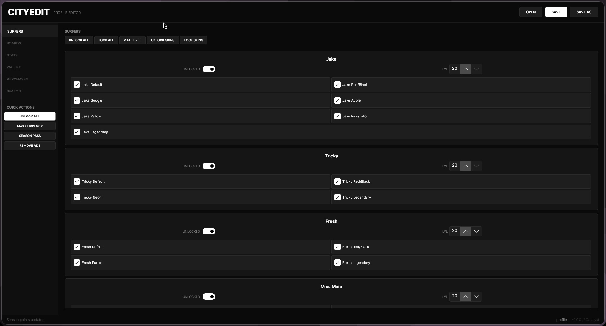 | 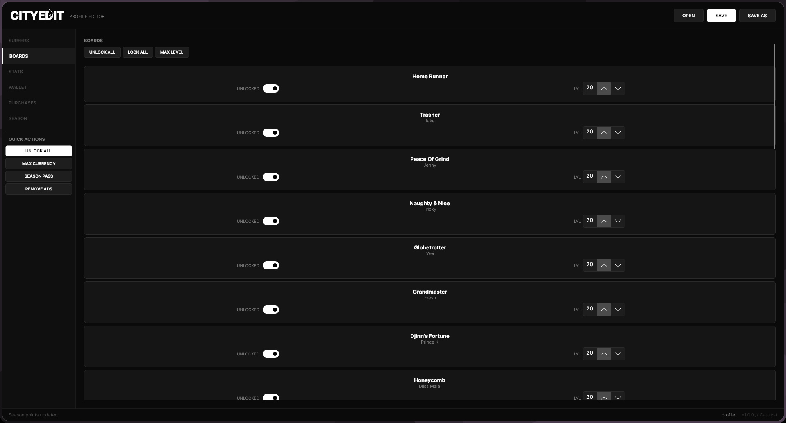 | 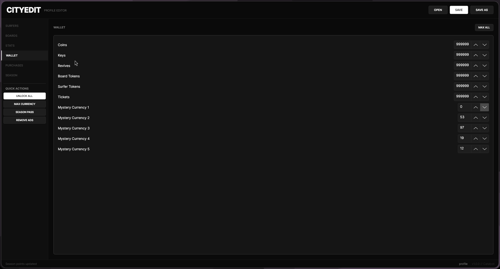 |

| Статистика | Покупки | Сезонный пропуск |
|------------|---------|------------------|
| 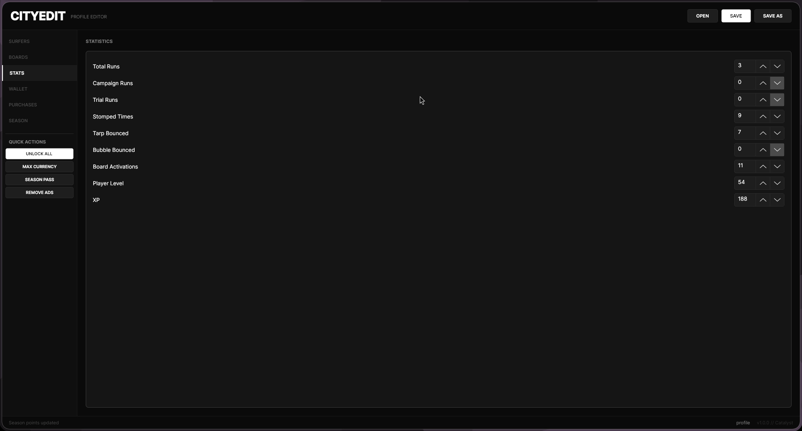 | 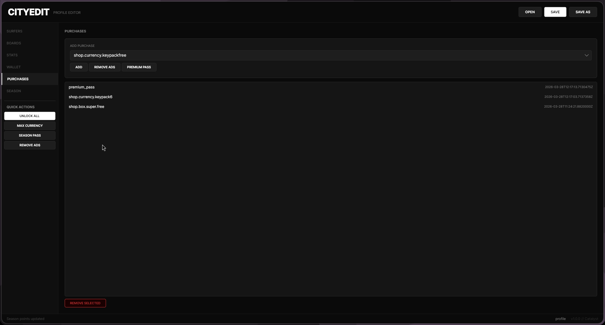 | 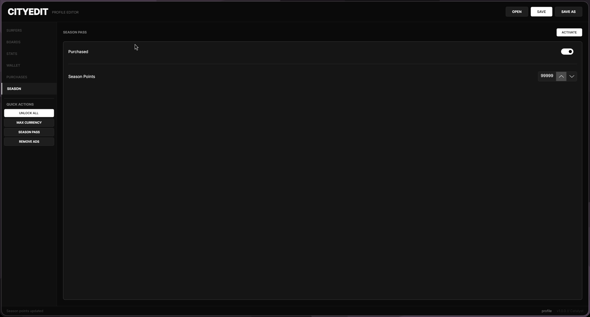 |

### Android

| Главная | Серферы | Доски |
|---------|---------|-------|
| 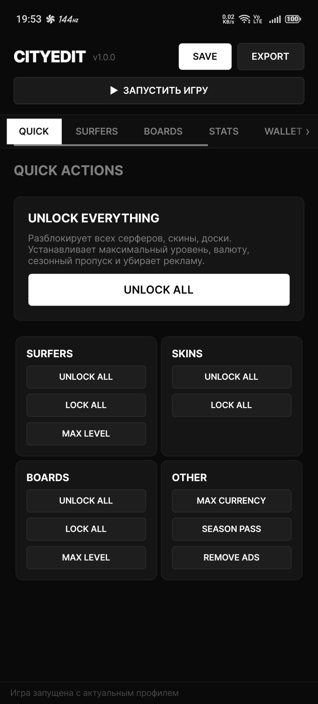 | 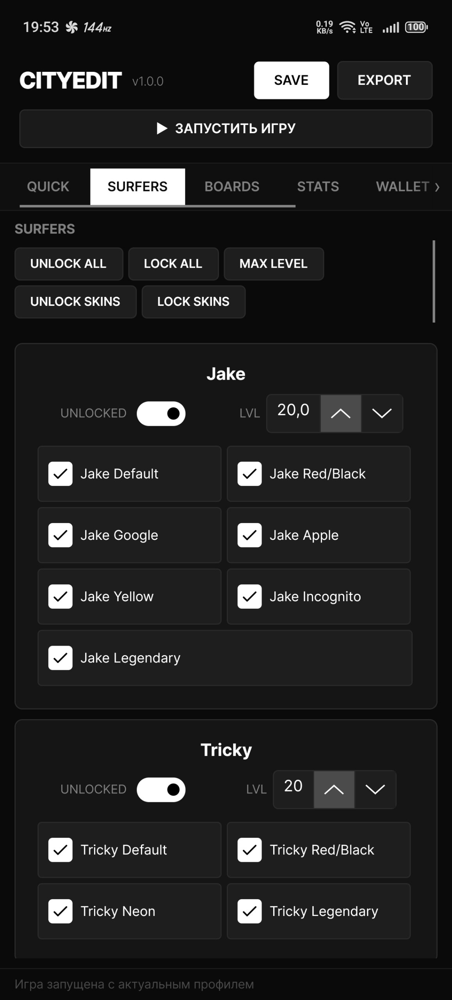 | 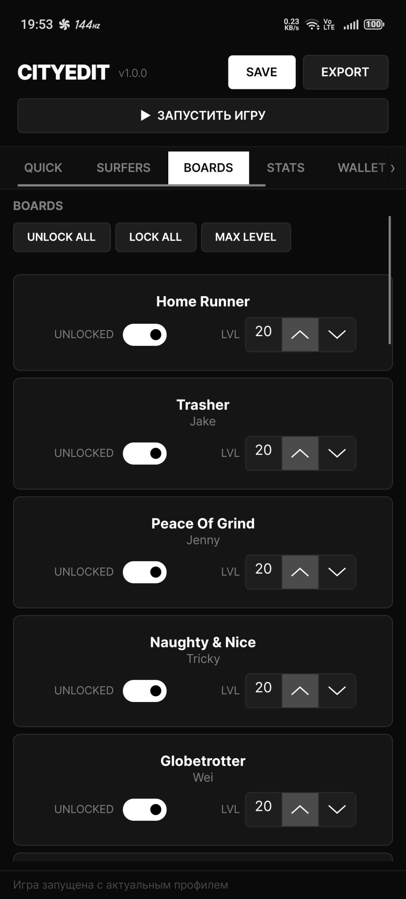 |

| Кошелек | Статистика | Покупки | Сезонный пропуск |
|---------|------------|---------|------------------|
| 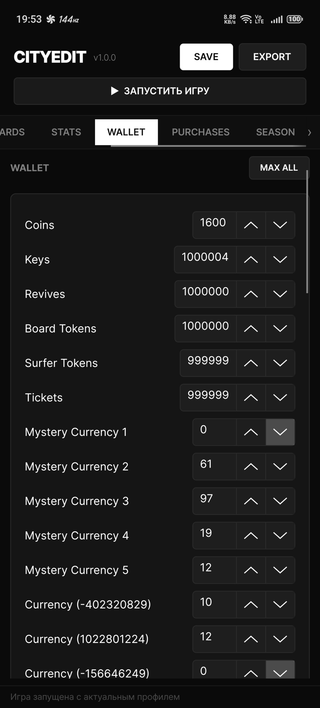 | 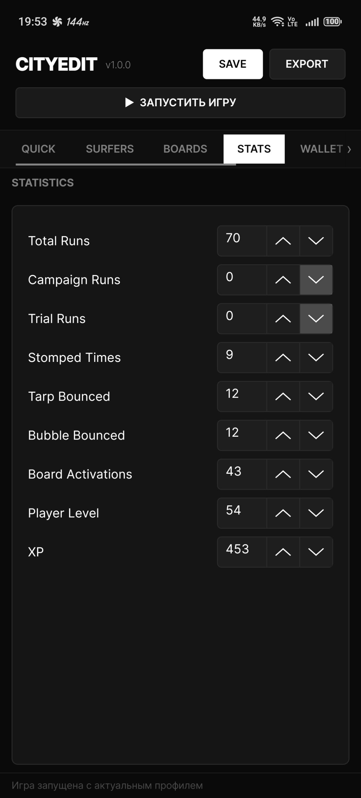 | 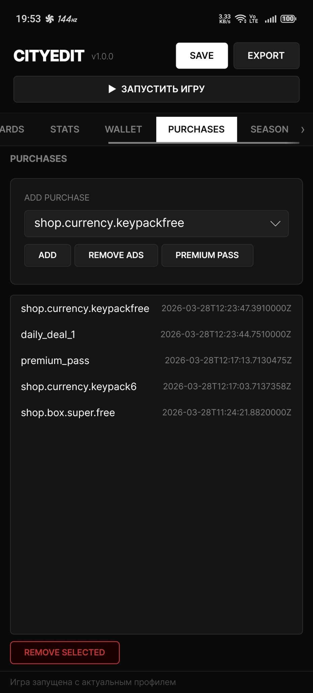 | 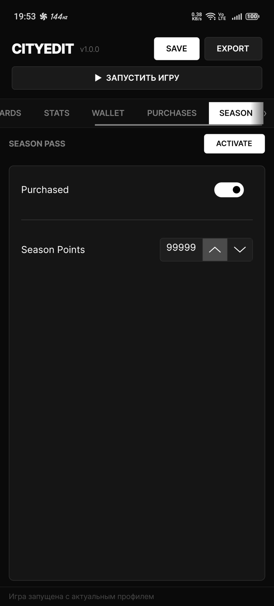 |

## Авторы

**Автор:** CatalystDev
**Контакт:** catalyst@raitokyokai.tech

## Лицензия

Этот проект лицензирован под [лицензией MIT](LICENSE).
